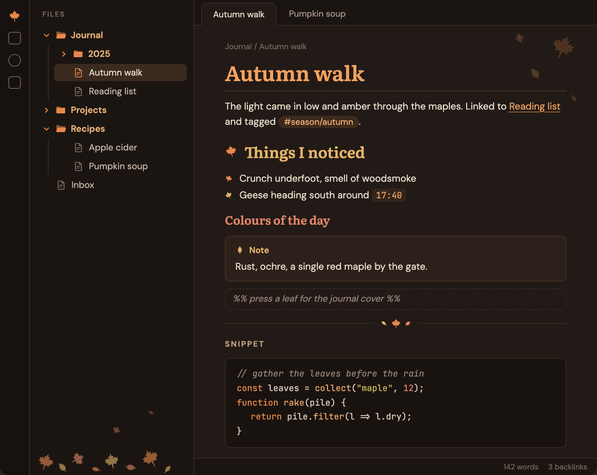
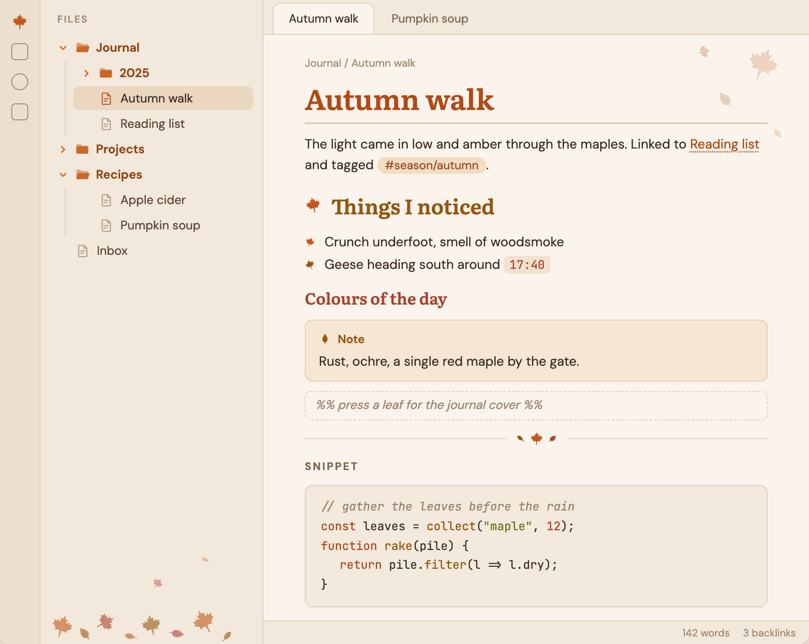
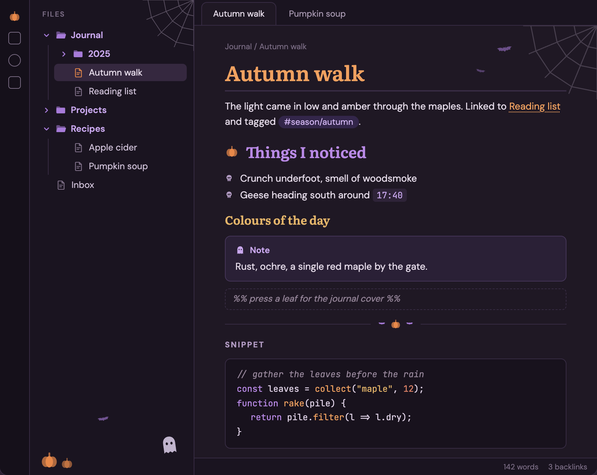
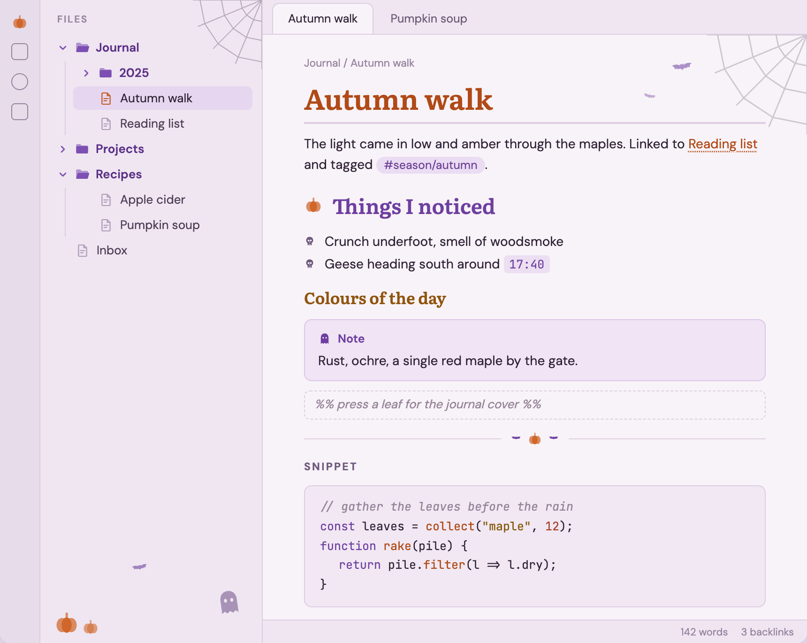

# Harvest

A warm autumn theme for [Obsidian](https://obsidian.md), in light and dark: burnt orange, amber and rust on fireside browns or warm parchment, with falling leaves, and a Halloween mode for October.









*These are design mockups, not captures of Obsidian. They show the design fonts (DM Sans, Literata, JetBrains Mono), which you need to install yourself (see [Fonts](#fonts)), and a "FILES" label that Obsidian's file explorer doesn't have. The shipped light palettes are a shade darker in a few places for contrast.*

- **Easy on the eyes.** Warm, low-glare backgrounds instead of pure black or white, and a relaxed 1.6 line height.
- **Folders and files are easy to tell apart.** Folders have bold names and filled two-tone folder icons that open and close; files have outlined page icons, and the open file's icon lights up in the accent color.
- **Every heading level looks different.** H1 to H3 are serif headings in their own color (H1 with a rule under it, H2 with a leaf marker), H4 is a small spaced-out caps label, H5 and H6 are muted.
- **Comments and code stand out from prose.** `%% comments %%` sit in an italic dashed box in the editor, inline code is a tinted pill, and code blocks have a border and autumn syntax colors.
- **Seasonal decor.** Maple bullets, leaves on horizontal rules and Note callouts, a leaf pile in the file explorer. Or switch to Halloween: pumpkins, skulls, bats, a ghost and cobwebs, on a violet-plum palette.
- **Readable.** Text, headings, links, tags, code and callout titles reach at least 4.5:1 contrast (WCAG AA) against their backgrounds, in all four palettes.
- **Desktop and mobile.** Touch-sized file tree rows (44px), mobile heading sizes, and code blocks that scroll instead of wrapping on phones.

## Install

**From Obsidian:** open **Settings → Appearance → Themes → Manage**, search for **Harvest**, then select **Install and use**.

**Manually:** download `manifest.json` and `theme.css` from the [latest release](https://github.com/raccoon-overlord-dev/obsidian-harvest-theme/releases/latest), put them in `<your vault>/.obsidian/themes/Harvest/`, and choose Harvest under **Settings → Appearance → Themes**.

Harvest needs Obsidian 1.5.0 or later. Light and dark follow Obsidian's own **Settings → Appearance → Base color scheme**.

## Options

Harvest works without any plugin; you get the Leaves decor. To change it, install the [Style Settings](https://github.com/mgmeyers/obsidian-style-settings) plugin and open **Settings → Style Settings → Harvest**:

| Setting | Options | Default |
| --- | --- | --- |
| **Seasonal decor** | **Leaves**: the ember palette with maple, oak and elm leaves. **Halloween**: the violet-plum palette with pumpkins, skulls, bats, a ghost and cobwebs. **Off**: the ember palette with no decorations (a small square before H2, plain bullets and rules). | Leaves |
| **Heading font** | The font for H1 to H3. Type the name of any font installed on your system. | Literata, then Georgia |

Halloween doesn't switch on by itself; pick it in Style Settings when the season comes.

The accent color (buttons, checkboxes, selection) is ember orange by default and follows Obsidian's **Settings → Appearance → Accent color** if you pick one. Headings, links, folders, code and decorations keep their autumn colors.

## Fonts

Harvest doesn't bundle any fonts, to stay small. It uses these free fonts if you have them installed, and your system's fonts otherwise:

- **DM Sans** for text and the interface,
- **Literata** for headings (falls back to Georgia),
- **JetBrains Mono** for code.

All three are free on [Google Fonts](https://fonts.google.com). To use other fonts, set them under **Settings → Appearance → Font** (text, interface and code) and, for headings, in the **Heading font** setting above.

## Known limitations

- **Corner decor in narrow panes.** The leaves (or bats and cobweb) in the top-right corner of a note stay in place while you scroll. In a pane that's narrower than the note text plus about 180px, they can sit faintly over the first lines. On phones they're hidden.
- **Bullet colors in Live Preview** alternate by editor line, so items separated by other lines may not alternate exactly as in Reading view.
- **Code block scrolling on mobile** works in Reading view. In Live Preview and Source mode, code lines follow the editor's line-wrapping setting.

## Development

`src/theme.css` is the source. The `theme.css` at the repository root is generated from it with the icons from `icons/` embedded, so don't edit it directly. Both scripts need only Python 3.8+ with no dependencies.

```sh
python3 build.py      # build theme.css from src/theme.css and icons/
python3 contrast.py   # check WCAG contrast of the color tokens (fails below 4.5:1)
```

The community directory reviews themes with [`stylelint-config-obsidianmd`](https://www.npmjs.com/package/stylelint-config-obsidianmd). To run the same checks locally (needs Node 22+), install them in a scratch folder outside the repo:

```sh
REPO="$PWD"
mkdir -p /tmp/harvest-lint && cd /tmp/harvest-lint
npm install --no-save stylelint@17 stylelint-config-obsidianmd
echo '{"extends":"stylelint-config-obsidianmd"}' > .stylelintrc.json
npx stylelint "$REPO/theme.css" --config .stylelintrc.json
cd "$REPO"
```

Only its **warnings** matter for the review; the formatting errors it also prints come from `stylelint-config-standard` and are ignored there. Keep `theme.css` under about 100 KB.

**Releasing:** bump `version` in `manifest.json`, rebuild, commit, then create a GitHub release whose tag is exactly that version (for example `1.0.0`, no `v`) and attach `manifest.json` and `theme.css`.

`test-vault/README.md` explains how to set up a test vault with the theme linked in.

## Credits and licenses

- Harvest theme, including its icons and decorations (`icons/`): [MIT](LICENSE), © raccoon-overlord-dev.
- Fonts suggested above (not bundled): DM Sans, Literata and JetBrains Mono, each under the SIL Open Font License 1.1.
